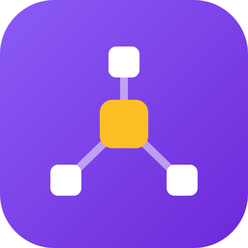

<p align="center">
  
</p>

<h1 align="center">repolink</h1>

<p align="center"><strong>One private repo, linked into every project.</strong></p>

<p align="center">An open-source, local-first CLI that symlinks one central private repo's folders into every GitHub project that needs them — share research, prompts, AI-agent context, templates, and dotfiles across many repos without copy-paste, submodules, or manual <code>ln -s</code>.</p>

<p align="center">
  <a href="https://github.com/thesatellite-ai/repolink-go/releases"></a>
  
  
  
  <a href="https://github.com/thesatellite-ai/repolink-go/stargazers"></a>
</p>

Keep your research, prompts, plans, snippets, and templates in one **central
private-repo** and surface them inside every GitHub project that needs them —
without copy-paste duplication, fragile submodules, or hand-rolled `ln -s`
that breaks on every fresh clone.

```
private-repo/
├── research/       ─┐
├── prompts/         │    symlinks travel with each consumer repo
├── codeskill/       │    via a committed .repolink.jsonc pin
└── templates/       ┘
                      │
                      ▼
project-a/research    (symlink → private-repo/research)
project-b/prompts     (symlink → private-repo/prompts)
project-c/notes       (symlink → private-repo/codeskill)
```

Mappings live in a SQLite `repo.db` at the private-repo root — committed +
portable via git. Every machine just needs to know where its local clone is.

- [Why repolink?](#why-repolink)
- [30-second example](#30-second-example)
- [Install](#install)
- [Use cases](#use-cases)
- [Quickstart](#quickstart)
- [Everyday commands](#everyday-commands)
- [Safety](#safety)
- [For AI agents](#for-ai-agents)
- [FAQ](#faq)
- [Learn more](#learn-more)
- [Status](#status)
- [License](#license)

## Why repolink?

You have evergreen, cross-cutting files — a prompt library, research notes, AI-agent skills, CI templates, dotfiles — that belong to *many* repos, not one. The usual options all hurt: **git submodules** are heavy, clone-fragile, and all-or-nothing; **copy-paste** duplicates and drifts the moment you edit one copy; a **package registry** is absurd overkill for a folder of notes; and **`ln -s` by hand** evaporates on every fresh clone.

repolink keeps **one source of truth** and surfaces it as plain symlinks, pinned in a committed `.repolink.jsonc` so any machine rebuilds every link with a single `repolink`. Edit once in the private-repo; every consumer sees the change instantly because it's the same file on disk.

- **One source, many consumers** — change a prompt or template once; it's live everywhere it's linked.
- **Survives fresh clones** — the pin is committed, so `repolink` re-materializes every symlink with zero manual steps.
- **Partial by design** — link a whole folder, a subfolder, or a single file. Submodules can't do that.
- **No nested-repo tax** — no detached HEADs, no `git submodule update`, no `.gitmodules` rituals.
- **Safe by default** — soft-delete, `--dry-run` on every mutator, and it never traverses or deletes your source folders.
- **AI-agent aware** — ships a Claude Code skill so your agent runs it on the right prompts.
- **Local-first & free** — a single Go binary, a committed SQLite pin, nothing in the cloud.

| | **repolink** | Git submodules | Copy-paste | Manual `ln -s` |
|---|:---:|:---:|:---:|:---:|
| One source of truth (edit once, live everywhere) | ✅ | ✅ | ❌ | ✅ |
| Rebuilds automatically on a fresh clone | ✅ | ⚠️ | n/a | ❌ |
| Link a subfolder or single file (not the whole repo) | ✅ | ❌ | ✅ | ✅ |
| No nested-repo / detached-HEAD overhead | ✅ | ❌ | ✅ | ✅ |
| Soft-delete + dry-run safety | ✅ | ❌ | ❌ | ❌ |
| Tracks + reports drift | ✅ | ⚠️ | ❌ | ❌ |
| AI-agent skill included | ✅ | ❌ | ❌ | ❌ |

## 30-second example

```sh
# Register the private-repo (once per machine):
cd ~/private-repo
repolink setup

# Inside any GitHub project:
cd ~/work/my-project
repolink link research docs/notes
# → created: docs/notes → symlink to ~/private-repo/research
# → added:   DB row in ~/private-repo/repo.db
# → added:   /docs/notes to .gitignore (managed block)

# On a fresh clone of my-project on another machine (after repolink setup):
repolink
# → every mapping materialized, no manual ln -s
```

## Install

macOS / Linux:

```sh
curl -sL https://raw.githubusercontent.com/thesatellite-ai/repolink-go/main/install.sh | sh
```

Or build from source: `git clone … && task install`.

## Use cases

- **AI / coding context reuse** — have your prompt library, research notes,
  or skill definitions show up inside every project directory so your editor
  and AI agent see them in context.
- **Personal knowledge base that follows your code** — keep evergreen notes
  in one place, make them visible alongside the specific project they're
  about, without duplicating files.
- **Template injection across many repos** — skeleton docs, CI snippets,
  `.editorconfig`, any shared boilerplate managed in one source, reflected
  everywhere.
- **Team knowledge cross-pollination** — one "reference" repo feeds many
  service repos; updates in one place propagate to all consumers.
- **Zero-config on fresh clones** — commit a `.repolink.jsonc` pin and any
  machine running `repolink` gets every symlink back.

See [docs/USE-CASES.md](./docs/USE-CASES.md) for detailed scenarios, and
[docs/USAGE.md](./docs/USAGE.md) for the full command reference.

## Quickstart

```sh
# 1. Register your private-repo clone (once per machine):
cd /path/to/private-repo
repolink setup

# 2. Inside any consuming repo, add mappings:
cd /path/to/some-project
repolink link research docs/                 # symlinks entire research/ into docs/
repolink link templates/go-ci .github/       # injects CI templates
repolink link prompts/summarize ./SUMMARY.md # single file

# 3. On a fresh clone of the same project elsewhere:
repolink                                     # bare form = auto-detect + sync
```

## Everyday commands

```sh
repolink                        # sync the current repo (headline UX)
repolink status                 # read-only view of mappings + live fs state
repolink link <src> [dest]      # add one mapping + symlink
repolink unlink <id|name>       # soft-delete (no fs change)
repolink cleanup --yes          # remove fs symlinks for trashed mappings
repolink pause <name>           # active → paused (symlink gone, row kept)
repolink resume <name>          # paused → active (symlink back)
repolink map list               # list mappings
repolink verify                 # drift report (read-only)
repolink state --json           # full machine-state snapshot (for scripts / AI)
repolink config --list          # every profile + default
repolink reset --all --yes      # nuclear: drop every profile + repo.db
```

Every mutating command supports `--dry-run`. Every read command supports
`--json`. Full reference: [docs/USAGE.md](./docs/USAGE.md).

## Safety

- **Never deletes symlink targets.** `cleanup`, `unlink`, `map purge`, `reset`
  only touch the symlink file itself — your source folders in the private-repo
  are never traversed.
- **Soft-delete by default.** `unlink` flips a mapping to `trashed`; the fs
  removal is a separate opt-in step (`cleanup`). Always reversible via
  `map restore` until purged.
- **`--dry-run` on every mutator.** Preview before committing.

## For AI agents

There's a Claude Code–compatible skill at
[`skills/repolink/SKILL.md`](./skills/repolink/SKILL.md). Install:

```sh
SKILL_BASE_URL=https://github.com/thesatellite-ai/repolink-go/tree/main \
  npx skill skills/repolink
```

Or manually:

```sh
mkdir -p ~/.claude/skills/repolink
curl -sL https://raw.githubusercontent.com/thesatellite-ai/repolink-go/main/skills/repolink/SKILL.md \
  -o ~/.claude/skills/repolink/SKILL.md
```

Claude Code will then pick up repolink on the right prompts ("symlink this
into", "why is this folder missing", etc.) and run the CLI via its Bash tool.

## FAQ

**Does repolink modify or delete my files?**
No. It only creates and removes the symlink files themselves — it never traverses or deletes the source folders in your private-repo. Deletes are soft by default (`unlink` → `trashed`, reversible until you `cleanup`), and every mutating command has `--dry-run`.

**How is this different from git submodules?**
No nested repositories, no detached HEADs, no `.gitmodules` ceremony. You can link a single subfolder or even one file (submodules are all-or-nothing), and edits are live immediately because the consumer sees the same file on disk.

**What happens on a fresh clone?**
Commit the `.repolink.jsonc` pin. On any machine that has run `repolink setup`, a bare `repolink` re-materializes every symlink automatically — no manual `ln -s`.

**Does it work across machines?**
Yes. Mappings live in a committed SQLite `repo.db`; each machine just registers where its local private-repo clone lives (`repolink setup`), once.

**Is my data sent anywhere?**
No. repolink is a single local Go binary. Everything — the database, the pins, the symlinks — stays on your machine.

**Can I link a single file instead of a whole folder?**
Yes. `repolink link prompts/summarize ./SUMMARY.md` links one file; you can link folders, subfolders, or files.

**Does it work with AI coding agents?**
Yes — it ships a Claude Code skill so agents invoke repolink on the right prompts ("symlink this into…", "why is this folder missing after cloning"), and every read command supports `--json` for scripting.

## Learn more

- **[docs/USE-CASES.md](./docs/USE-CASES.md)** — detailed pain points +
  real-world scenarios + who this is for
- **[docs/USAGE.md](./docs/USAGE.md)** — comprehensive command reference
  with examples + workflows
- **[skills/repolink/SKILL.md](./skills/repolink/SKILL.md)** — Claude Code
  skill (user-facing CLI usage guide for AI agents)

## Status

v0.1.0 — all core commands shipped, 9 test packages green. See
[releases](https://github.com/thesatellite-ai/repolink-go/releases).

## License

TBD.

<sub><strong>repolink</strong> — open-source, local-first CLI to symlink one private repo's folders (research, prompts, AI-agent context, templates, dotfiles) into every GitHub project. A lighter alternative to git submodules and copy-paste. No cloud, no submodules, no manual <code>ln -s</code>.</sub>
